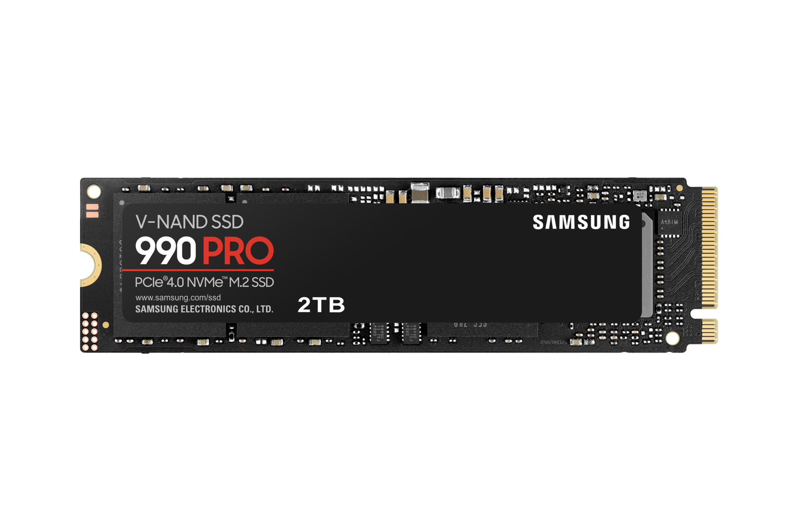

# Samsung 990 Pro

## Specifications

- Product code : MZ-V9P4T0BW
- Capacity : 4TB
- Interface : M.2 PCIe
- Interface version : PCIe 4.0
- Transfer rate read : 7450 MB/s
- Transfert rate write : 6900 MB/s
- MTBF : 1500000h

## Links

- [Product Page](https://www.samsung.com/ca/support/model/MZ-V9P2T0B/AM/)
