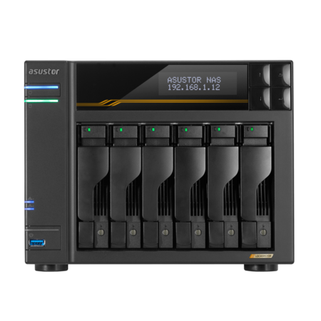

# asustor Lockerstor 6 Gen3 (AS6806T)

## Specifications

### CPU

- CPU Model : AMD Ryzen V3C14
- CPU Architecture : x64 64-bit
- CPU Frequency : Quad-Core2.3 GHz (turbo 3.8GHz)

### Memory

- RAM : 1x 16GB ECC DDR5-4800 SO-DIMM
- Total Memory Slots : 2
- Memory Expandable up to : 64GB
- Memory informations :
    - Support mixed capacity
    - Support ECC memory
    - ECC functionality will be disabled if non-ECC memory is installed or mixed with ECC memory
- Flash Memory : 8GB eMMC

### Storage

- Drive Bays : 6
- M.2 Drive Slots : 4
- Compatible Drive Type :
    - 3.5" SATA HDD
    - 2.5" SATA HDD
    - 2.5" SATA SSD
    - M.2 2280 NVMe
- M.2 PCIe Interface : PCIe 4.0 x1
- Maximum Drive Bays with Expansion Unit : 18
- Supports Hot Swappable Drives : Yes

### External Ports

#### Expansion

- 3x USB 3.2 Gen2 (10Gbps) Type-A
- 2x USB 4.0 (40Gbps) Type-C
- USB 4.0 is backward compatible with 3.2 Gen2 (10Gpbs), USB 3.2 Gen1 (5Gbps) and 2.0
- The Lockerstor Gen3 series are based on AMD's current USB4 driver. AMD USB4 at the moment only supports external storage devices and direct connection between another Lockerstor Gen 3 series NAS.

#### Network

- 2x 5Gigabit Ethernet (5G/2.5G/1G/100M)
- 2x 10Gigabit Ethernet (10G/2.5G/1G/100M)

#### PCIe Expansion Slots

- 1x for optional expansion 10GbE card (Removal of M.2 card necessary for expansion card installation)

#### Multimedia Output

- N/A

### Others

- System Fan : 1x 120mm
- LCD Panel : Yes
- Power Supply Unit / Adapter : 250W x1
- Input Power Voltage : 100V to 240V / AC
- Power Consumption : 45W Operation / 2.3W Sleep Mode
- Certification : FCC, CE, VCCI, BSMI, C-TICK, KCC, BIS, CCC, UKCA

## Hard Drives Setup

### SSD

- 4x Samsung 990 Pro 4TB
- RAID : 10

### HDD

- 6x [Seagate IronWolf](ironwolf.md) 8TB
- RAID : 6

## Links

- [Product Page](https://www.asustor.com/en/product?p_id=87)
- [Specs](https://www.asustor.com/product/spec?p_id=87)
- [Performance](https://www.asustor.com/product/performance?p_id=87)
- [DataSheet](https://www.asustor.com/datasheet?p_id=87)
