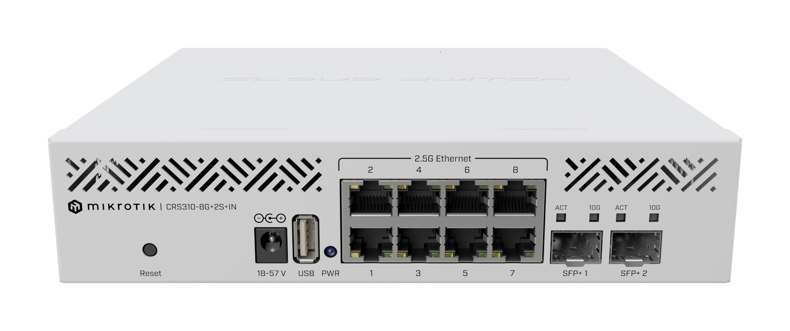
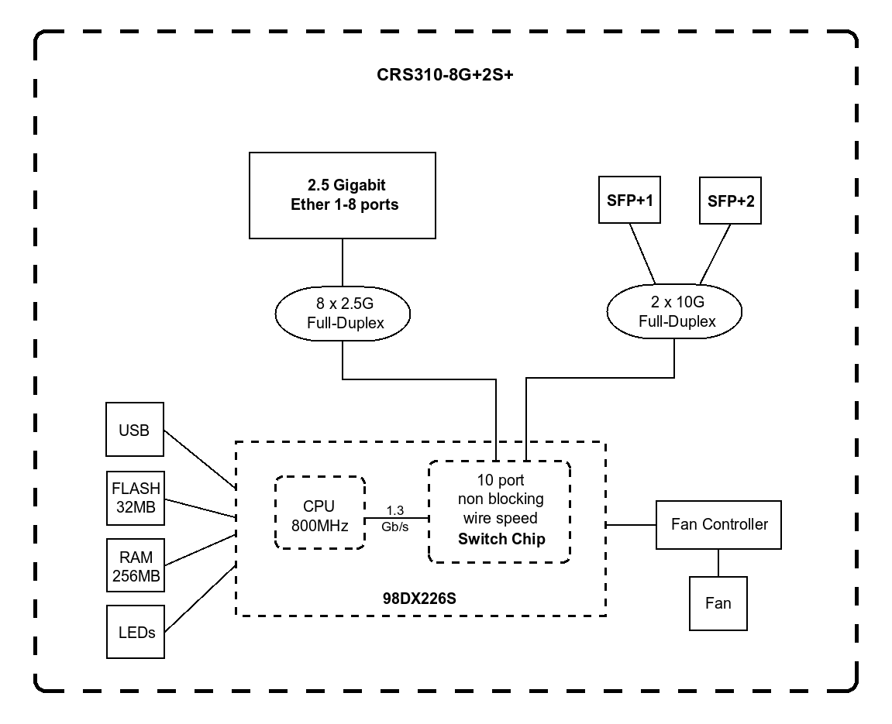

# MikroTik CRS310-8G+2S+IN

## Specifications

### General

- Product code : CRS310-8G+2S+IN
- Architecture : ARM 32bit
- CPU : 98DX226S
- CPU core count : 2
- CPU nominal frequency : 800 MHz
- Switch chip model : 98DX226S
- Operating System : RouterOS / SwithcOS
- Size of RAM : 256 MB
- Storage type : Flash

### Powering

- Number of DC inputs : 1 (DC jack)
- DC jack input Voltage : 18-57 V
- Max power consumption : 34 W
- Max power consumption without attachments : 21 W
- Cooling type : 1 fan

### Ethernet

- Number of 2.5G Ethernet ports : 8

### Fiber

- SPF+ ports : 2

### Peripherals

- Number of USB ports : 1
- USB Power Reset : Yes
- USB slot type : USB type A
- Max USB current (A) : 1

### Other

- CPU temperature monitor : Yes
- PCB temperature monitor : Yes

### Certification & Approvals

- Certification : CE, EAC, ROHS
- IP : 20

## Block Digram

## Links

- [Brochure](https://cdn.mikrotik.com/web-assets/product_files/CRS310_8G_2S_IN_230826.pdf)
- [DOC](https://cdn.mikrotik.com/web-assets/product_files/ID234.1_CRS310-8G2SIN_DOC_260238.pdf)
- [Dimensions](https://cdn.mikrotik.com/web-assets/product_files/CRS310-8G2SINDimensions_250811.pdf)
- [User Manual](https://help.mikrotik.com/docs/pages/viewpage.action?pageId=214630429)
- [Quick Guide](https://help.mikrotik.com/docs/pages/viewpage.action?pageId=136839182)
