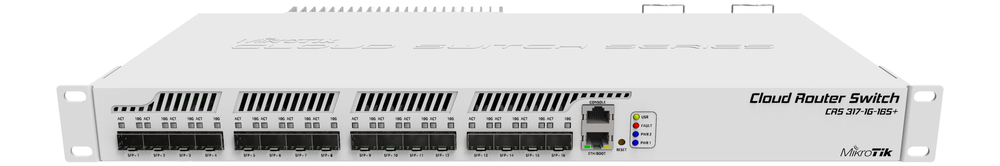

# MikrotIk CRS317-1G-16S+RM

## Specification

### General

- Product code : CRS317-1G-16S+RM
- Architecture : ARM 32bit
- CPU : 98DX8216
- CPU core count : 2
- CPU nominal frequency : 800 MHz
- CPU Threads count : 2
- Switch chip model : 98DX8216
- Operating System : RouterOS / SwitchOS
- Size of RAM : 1 GB
- Storage size : 16 MB
- Storage type : Flash

### Powering

- Number of AC inputs : 2
- AC input range : 100-240
- Number of PSU slots : 2
- Frequency (Hz) : 50-60
- Max power consumption : 44 W
- Cooling type : 2 fans

### Ethernet

- 10/100/1000 Ethernet ports : 1

### Fiber

- SFP+ ports : 16

### Peripherals

- Serial console port : RJ45

### Other

- CPU temperature monitor : Yes
- Beeper : Yes

## Block Diagram

## Links

- [Brochure](https://cdn.mikrotik.com/web-assets/product_files/CRS317-1G-16Splus_211004.pdf)
- [User Manual](https://help.mikrotik.com/docs/x/TAASAQ)
- [Quick Guide](https://help.mikrotik.com/docs/x/CQLZ)
- [DOC](https://cdn.mikrotik.com/web-assets/product_files/ID085.1_CRS317-1G-16SRM_DOC_221010.pdf)
- [Quick Start](https://cdn.mikrotik.com/web-assets/product_files/CRS317-1G-16S-qg_200107.pdf)
