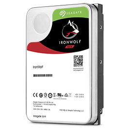

# Seagate IronWolf

## Specifications

- Product code : ST8000VN004
- Capacity : 8TB
- Interface : SATA 6Gb/s
- Cache : 256MB
- Rotational Vibration Sensors : Yes
- Formfactor : 3.5"
- HDD transfer rate : 210MB/s
- Max. Rotation speed : 7200RPM
- MTBF : 1000000h

## Links

- [Product Page](https://www.seagate.com/support/internal-hard-drives/nas-drives/ironwolf/)
- [DataSheet](https://www.seagate.com/content/dam/seagate/en/content-fragments/products/datasheets/ironwolf-12tb/ironwolf-16tb-DS1904-23-2509US-en_US.pdf)
- [User Manual](https://www.seagate.com/content/dam/seagate/migrated-assets/www-content/product-content/ironwolf/en-us/docs/100844482f.pdf)
