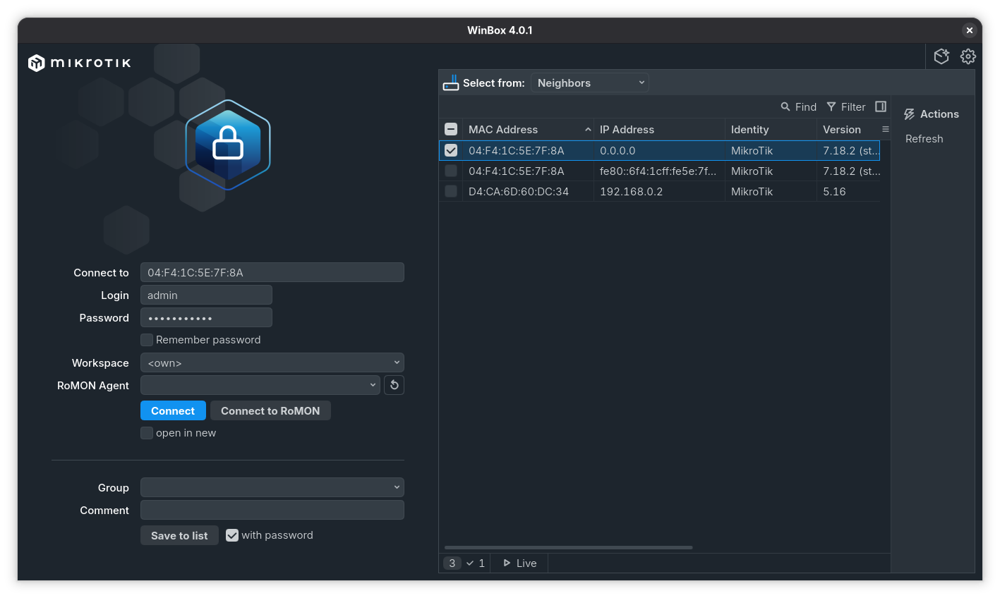

# Setup CRS-8G+2S+IN

## Première connexion



Pour ce connecter pour la première fois facilement et sans devoir changer de réseau. Il suffit de séléctionner
l'adresse MAC afin que WinBox se connecte en ARP (L2).

Pour le *CRS-8G+2S+IN* le compte par défaut est `admin` et le mot de passe par défaut sur trouve
sur l'étiquette sous le switch.

## Changer le mot de passe par défaut

Lors de la première connexion, il est demandé de changer le mot de passe par défaut.
Mettre quelque chose de fort.

## Configurer l'addresse IP de management

Pour le moment, nous sommes connecter au switch via layer2, nous voulons lui attribuer
une addresse IP qui nous permettra de nous connecter en SSH via le réseau local.

Je vais lui donner l'addresse IP `192.168.1.2/24` sur l'interface `ether1`

```bash
[admin@MikroTik] > ip address add address=192.168.1.2/24 interface=ether1
[admin@MikroTik] > ip address print
Columns: ADDRESS, NETWORK, INTERFACE
# ADDRESS         NETWORK      INTERFACE
0 192.168.1.2/24  192.168.1.0  ether1   
```

Maintenant, je peux ping le switch via son adresse IP.

```bash
❯ ping 192.168.1.2
PING 192.168.1.2 (192.168.1.2) 56(84) octets de données.
64 octets de 192.168.1.2 : icmp_seq=1 ttl=64 temps=0.582 ms
64 octets de 192.168.1.2 : icmp_seq=2 ttl=64 temps=0.608 ms
64 octets de 192.168.1.2 : icmp_seq=3 ttl=64 temps=0.313 ms
^C
--- statistiques ping 192.168.1.2 ---
3 paquets transmis, 3 reçus, 0% packet loss, time 2038ms
rtt min/avg/max/mdev = 0.313/0.501/0.608/0.133 ms
```

Et je peux me connecter en SSH sur son adresse IP avec le compte admin.

```bash
❯ ssh admin@192.168.1.2
The authenticity of host '192.168.1.2 (192.168.1.2)' can't be established.
RSA key fingerprint is SHA256:9XBh3C0YdjloA0inoW0ILIdbCdP8OUnvyjft9iRtxmE.
This key is not known by any other names.
Are you sure you want to continue connecting (yes/no/[fingerprint])? yes
Warning: Permanently added '192.168.1.2' (RSA) to the list of known hosts.
admin@192.168.1.2's password: 

  


  MMM      MMM       KKK                          TTTTTTTTTTT      KKK
  MMMM    MMMM       KKK                          TTTTTTTTTTT      KKK
  MMM MMMM MMM  III  KKK  KKK  RRRRRR     OOOOOO      TTT     III  KKK  KKK
  MMM  MM  MMM  III  KKKKK     RRR  RRR  OOO  OOO     TTT     III  KKKKK
  MMM      MMM  III  KKK KKK   RRRRRR    OOO  OOO     TTT     III  KKK KKK
  MMM      MMM  III  KKK  KKK  RRR  RRR   OOOOOO      TTT     III  KKK  KKK

  MikroTik RouterOS 7.18.2 (c) 1999-2025       https://www.mikrotik.com/


Press F1 for help

[admin@MikroTik] > 
```

## Configurer la route par défaut

Avec la configuration actuelle, je ne peux pas ping l'extérieur avec le status *no route to host*.

```bash
[admin@MikroTik] > ping 1.1.1.1
  SEQ HOST                                     SIZE TTL TIME       STATUS                                                         
    0                                                              no route to host                                               
    1                                                              no route to host                                               
    sent=2 received=0 packet-loss=100% 
```

Si j'affiche les routes, je vois que lors que j'ai ajouter l'adresse IP au port de management,
RouterOS à automatiquement créer une route par défaut pour le réseau *192.168.1.0/24*.

```bash
[admin@MikroTik] > ip route/ print 
Flags: D - DYNAMIC; A - ACTIVE; c - CONNECT
Columns: DST-ADDRESS, GATEWAY, DISTANCE
    DST-ADDRESS     GATEWAY  DISTANCE
DAc 192.168.1.0/24  ether1          0
```

Pour que notre ping arrive a l'extérieur, nous allons devoir créer une route par défaut pour 
accéder à internet.

```bash
[admin@MikroTik] > ip route add dst-address=0.0.0.0/0 gateway=192.168.1.1
[admin@MikroTik] > ip route print
Flags: D - DYNAMIC; A - ACTIVE; c - CONNECT, s - STATIC
Columns: DST-ADDRESS, GATEWAY, DISTANCE
#     DST-ADDRESS     GATEWAY      DISTANCE
0  As 0.0.0.0/0       192.168.1.1         1
  DAc 192.168.1.0/24  ether1              0
```

Je peux maintenant ping l'extérieur.

```bash
[admin@MikroTik] > ping 1.1.1.1
  SEQ HOST                                     SIZE TTL TIME       STATUS                                                         
    0 1.1.1.1                                    56  56 20ms492us 
    1 1.1.1.1                                    56  56 14ms775us 
    sent=2 received=2 packet-loss=0% min-rtt=14ms775us avg-rtt=17ms633us max-rtt=20ms492us
```

## Configurer la résolution DNS

Nous avons vu que nous arrivons a ping une adresse IP externe grace à notre route par défaut. 
Mais, nous ne pouvons toujours pas ping un DNS name.

```bash
[admin@MikroTik] > ping admin.ch
invalid value for argument address:
    invalid value of mac-address, mac address required
    invalid value for argument ipv6-address
    while resolving ip-address: could not get answer from dns server
```

Afin de faire la résolution, nous devons configurer des serveurs DNS que le switch pourra utiliser afin 
de pouvoir joindre un DNS name.

```bash
[admin@MikroTik] > ip dns/ print
                      servers:        
              dynamic-servers:        
               use-doh-server:        
              verify-doh-cert: no     
   doh-max-server-connections: 5      
   doh-max-concurrent-queries: 50     
                  doh-timeout: 5s     
        allow-remote-requests: no     
          max-udp-packet-size: 4096   
         query-server-timeout: 2s     
          query-total-timeout: 10s    
       max-concurrent-queries: 100    
  max-concurrent-tcp-sessions: 20     
                   cache-size: 2048KiB
                cache-max-ttl: 1w     
      address-list-extra-time: 0s     
                          vrf: main   
           mdns-repeat-ifaces:        
                   cache-used: 36KiB  
[admin@MikroTik] > ip dns/ set servers=1.1.1.1,8.8.8.8
[admin@MikroTik] > ip dns print
                      servers: 1.1.1.1
                               8.8.8.8
              dynamic-servers:        
               use-doh-server:        
              verify-doh-cert: no     
   doh-max-server-connections: 5      
   doh-max-concurrent-queries: 50     
                  doh-timeout: 5s     
        allow-remote-requests: no     
          max-udp-packet-size: 4096   
         query-server-timeout: 2s     
          query-total-timeout: 10s    
       max-concurrent-queries: 100    
  max-concurrent-tcp-sessions: 20     
                   cache-size: 2048KiB
                cache-max-ttl: 1w     
      address-list-extra-time: 0s     
                          vrf: main   
           mdns-repeat-ifaces:        
                   cache-used: 38KiB  
[admin@MikroTik] > ping google.com
  SEQ HOST                                     SIZE TTL TIME       STATUS                                                         
    0 74.125.29.102                              56 112 20ms239us 
    1 74.125.29.102                              56 112 15ms254us 
    sent=2 received=2 packet-loss=0% min-rtt=15ms254us avg-rtt=17ms746us max-rtt=20ms239us
```

Nous pouvons maintenant ping un DNS name.

## Mettre à jour le swtich

Maintenant que nous pouvons joindre l'extérieur et que nous avons la résolution de nom 
nous allons pouvons mettre à jour le switch.

Nous pouvons afficher la version actuelle de l'OS.

```bash
[admin@MikroTik] > system/package/ print
Columns: NAME, VERSION, BUILD-TIME, SIZE
# NAME      VERSION  BUILD-TIME           SIZE   
0 routeros  7.18.2   2025-03-11 11:59:04  11.5MiB
```

Je suis actuellement en version *7.18.2*.

Nous pouvons vérifié si il n'y a pas une version plus récente de l'OS disponible.

```bash
[admin@MikroTik] > system/package/update/ check-for-updates 
            channel: stable                  
  installed-version: 7.18.2                  
     latest-version: 7.21.3                  
             status: New version is available
```

Ici, j'ai une nouvelle version disponible, la version *7.21.3*.

Je vais mettre à jour vers cette dernière version.

```bash
[admin@MikroTik] > system/package/update/ install
            channel: stable                 
  installed-version: 7.18.2                 
     latest-version: 7.21.3                 
             status: Downloaded 62% (7.2MiB)
Received disconnect from 192.168.1.2 port 22:11: shutdown/reboot
Disconnected from 192.168.1.2 port 22
```

Avec la commande `install`, le système va télécharger la mise à jour et 
directement l'installer. C'est pourquoi je perd la connexion SSH.

Je ping l'adresse du switch en continue pour voir quand l'update est 
terminée.

```bash
❯ ping 192.168.1.2
PING 192.168.1.2 (192.168.1.2) 56(84) octets de données.
De 192.168.1.120 icmp_seq=1 Hôte de destination injoignable
De 192.168.1.120 icmp_seq=2 Hôte de destination injoignable
De 192.168.1.120 icmp_seq=3 Hôte de destination injoignable
...
...
...
64 octets de 192.168.1.2 : icmp_seq=120 ttl=64 temps=0.323 ms
64 octets de 192.168.1.2 : icmp_seq=121 ttl=64 temps=0.331 ms
64 octets de 192.168.1.2 : icmp_seq=122 ttl=64 temps=0.338 ms
^C
--- statistiques ping 192.168.1.2 ---
122 paquets transmis, 15 reçus, +104 erreurs, 87.7049% packet loss, time 123880ms
rtt min/avg/max/mdev = 0.278/205.030/2047.517/554.345 ms, pipe 4
```

```bash
[admin@MikroTik] > system/package/ print 
Columns: NAME, VERSION, BUILD-TIME, SIZE
# NAME      VERSION  BUILD-TIME           SIZE   
0 routeros  7.21.3   2026-02-12 13:10:04  11.7MiB
```

Je suis maitnenant en *7.21.3*.
